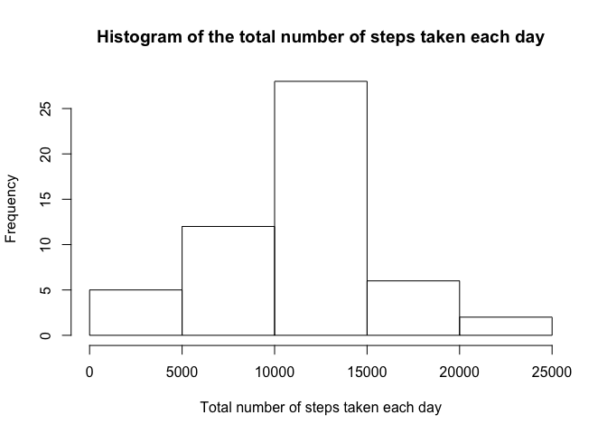
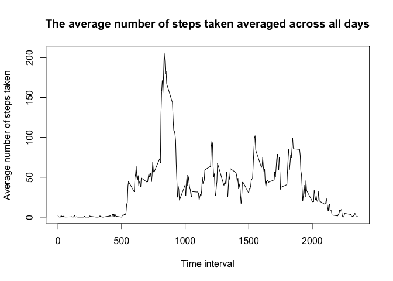
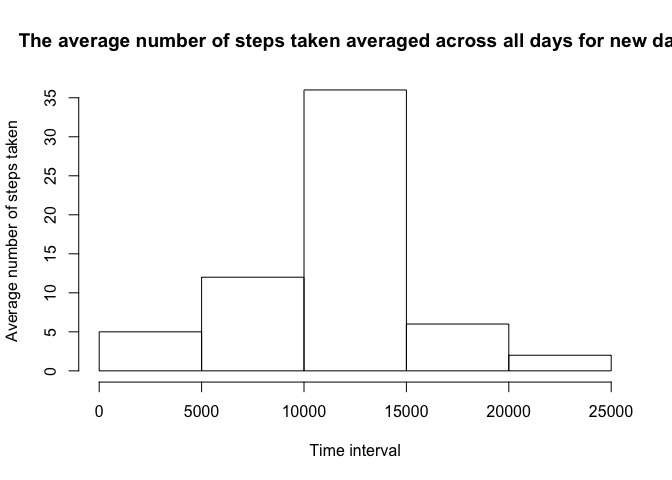
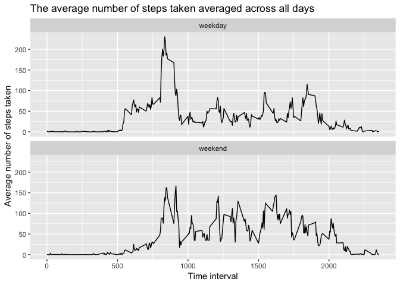

```r
library(ggplot2)
```


## Loading and preprocessing the data

```r
## Load the data using `read.csv()`
filename <- "activity.csv"
data_raw <- read.csv(filename, header = TRUE, sep = ",")

## convert the date data
data_raw[,2] <- as.Date(as.character(data_raw[,2]), format = "%Y-%m-%d")

## Remove data entries associated with NA steps
data <- data_raw[with(data_raw, !(is.na(steps))), ]
```

## What is mean total number of steps taken per day?

```r
## Calculate the total number of steps taken per day
step_by_day <- aggregate(data$steps, by=list(data$date), sum)
names(step_by_day) <- c("date", "total step")

## Plot the histogram
hist(step_by_day$`total step`, main = "Histogram of the total number of steps taken each day", xlab = "Total number of steps taken each day")
```

<!-- -->

```r
## Calculate and report the mean and median of the total number of steps taken per day
mean(step_by_day$`total step`)
```

```
## [1] 10766.19
```

```r
median(step_by_day$`total step`)
```

```
## [1] 10765
```


## What is the average daily activity pattern?

```r
## Calculate the averge number of steps taken by 5-minute interval
step_by_interval <- aggregate(steps ~ interval, data, mean)

## Create a time series plot
plot(step_by_interval$interval, step_by_interval$steps, type = 'l', main = "The average number of steps taken averaged across all days", xlab = "Time interval", ylab = "Average number of steps taken")
```

<!-- -->

```r
## find the entry corresponding to max steps
row_max_step <- which.max(step_by_interval$steps)
step_by_interval[row_max_step,]
```

```
##     interval    steps
## 104      835 206.1698
```

## Imputing missing values

```r
## the total number of missing values in the dataset
total_missing_value <- sum(is.na(data_raw$steps))
total_missing_value
```

```
## [1] 2304
```

```r
## substitute the missing steps values use the mean for that time interval since all data are missing for 2012-10-01
data_filling <- data_raw
for (i in 1:nrow(data_raw)){
  if (is.na(data_raw$steps[i])){
    ## find the date 
    interval_value <- data_raw$interval[i]
    ## find the average step for that day
    step_value <- step_by_interval[step_by_interval$interval==interval_value,]$steps
    ## fill the NA value
    data_filling$steps[i] <- step_value
  }
}

## calculate the total number of steps taken each day for the new data 
step_by_day_new <- aggregate(data_filling$steps, by=list(data_filling$date), sum)
names(step_by_day_new) <- c("date", "total step")

## plot the histogram
hist(step_by_day_new$`total step`, main = "The average number of steps taken averaged across all days for new data", xlab = "Time interval", ylab = "Average number of steps taken")
```

<!-- -->

```r
## calculate the mean and median total number of steps taken per day of new data
mean(step_by_day_new$`total step`)
```

```
## [1] 10766.19
```

```r
median(step_by_day_new$`total step`)
```

```
## [1] 10766.19
```

```r
## original data
mean(step_by_day$`total step`)
```

```
## [1] 10766.19
```

```r
median(step_by_day$`total step`)
```

```
## [1] 10765
```

## Are there differences in activity patterns between weekdays and weekends?

```r
## create new column in data_filling specifying weekday or weekend
data_filling['day of week'] <- weekdays(data_filling$date)
data_filling$`day of week`[data_filling$`day of week`  %in% c('Monday','Tuesday', 'Wednesday', 'Thursday', 'Friday') ] <- "weekday"
data_filling$`day of week`[data_filling$`day of week`  %in% c('Saturday','Sunday') ] <- "weekend"

## convert day of week to factor
data_filling$`day of week` <- as.factor(data_filling$`day of week`)

## calculate the average steps by interval
data_filling_by_interval <- aggregate(steps ~ interval + `day of week`, data_filling, mean)

## create a time series plot
timePlot <- qplot(interval, steps, data = data_filling_by_interval, geom = c('line'), main = "The average number of steps taken averaged across all days", xlab = "Time interval", ylab = "Average number of steps taken")+facet_wrap(~`day of week`, ncol = 1)
print(timePlot)
```

<!-- -->
